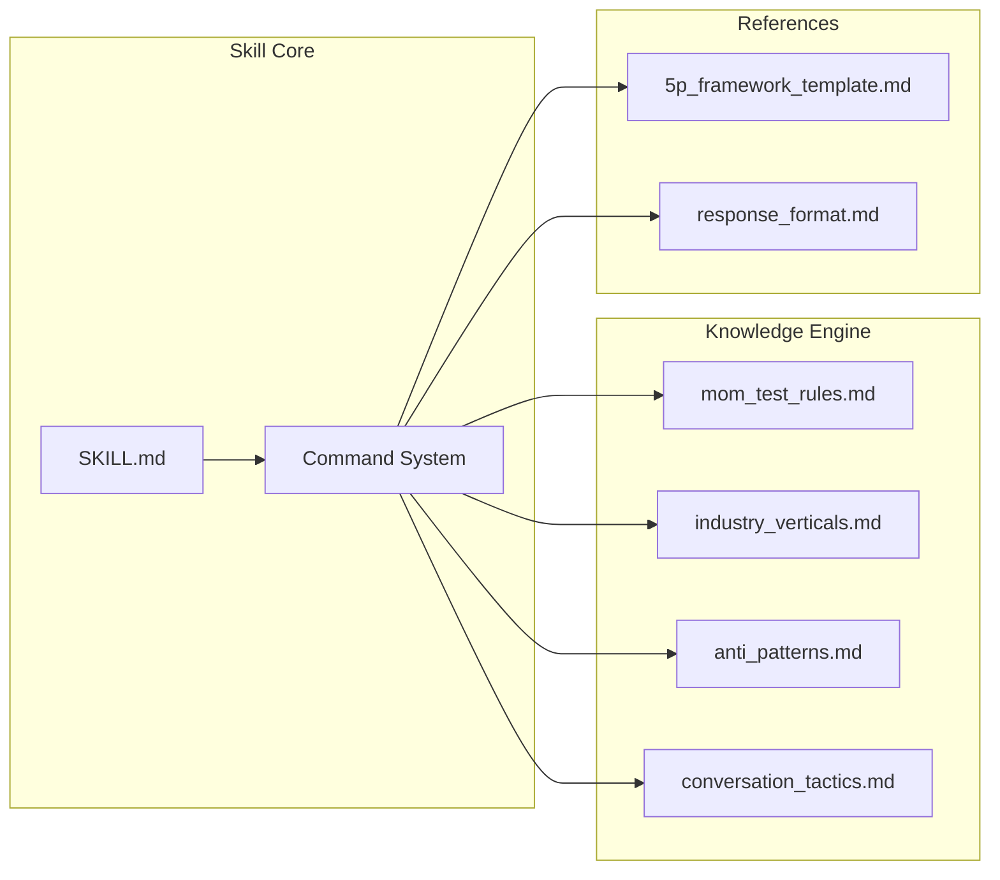

# PersonaTwin: The Mom Test Simulation Skill 🤖 (Tiếng Việt)

> 🌍 [English](README.md) | 🇻🇳 [Tiếng Việt](README-vi.md)
> 📖 [User Guide](USER_GUIDE.md) | 🇻🇳 [Hướng dẫn Sử dụng](USER_GUIDE-vi.md)

**Kỹ năng AI chuyên dụng đóng vai trò như một đám mây giả lập người dùng (synthetic user testing cloud). PersonaTwin áp dụng các nguyên tắc "The Mom Test" để tạo ra những phản hồi thực tế, "phũ phàng" — bảo vệ Product Managers khỏi những thiên kiến cá nhân.**

[](LICENSE)
[](SKILL.md)
[](tests/promptfooconfig.yaml)
[](SKILL.md)

---

## 🎯 Giá trị cốt lõi

Xây dựng sản phẩm mà khách hàng thực sự muốn là một thử thách lớn, bởi vì người dùng thường "nói dối" một cách lịch sự. **PersonaTwin** bảo vệ bạn khỏi những định kiến cá nhân bằng cách đóng vai trò là một "bộ lọc sự thật."

- **🚫 Loại bỏ lời khen**: Tự động lọc ra những câu "Nghe hay đấy!" và chỉ trích xuất bằng chứng thực tế về hành vi người dùng.
- **⚡ Thử nghiệm nhanh**: Kiểm chứng ý tưởng tính năng với persona thực tế trước khi viết bất kỳ dòng code nào.
- **🧪 Mom Test đóng gói**: Logic tích hợp tuân thủ nghiêm ngặt các nguyên tắc của Rob Fitzpatrick — tập trung vào hành vi quá khứ và nỗi đau hiện tại.
- **🏗️ Persona có cấu trúc**: Sử dụng khung **5P Framework** (Profile, Psychology, Pains, Proficiency, Principles) để giả lập với độ tin cậy cao.
- **🏭 Preset theo ngành**: Hành vi persona được cấu hình sẵn cho SaaS B2B, F&B/Bán lẻ, FinTech, EdTech, Consumer App và Security/Cybersecurity.
- **🔍 Phát hiện Anti-Pattern**: Tự động phát hiện các lỗi PM thường gặp như Feature Dumping, Solution First, và Future Tense Trap.

---

## 🏗️ Kiến trúc



### Cấu trúc thư mục

```
personatwin-skill/
├── SKILL.md                          # Định nghĩa skill (Open Standard)
├── knowledge/                        # Hệ thống tri thức mô-đun
│   ├── mom_test_rules.md             # Quy tắc Mom Test + Truth Filter
│   ├── industry_verticals.md         # Hành vi theo ngành: SaaS, F&B, FinTech, EdTech, Consumer, Security
│   ├── anti_patterns.md              # Thư viện phát hiện anti-pattern của PM
│   └── conversation_tactics.md       # Kỹ thuật hội thoại thực tế
├── references/                       # Template & định dạng output
│   ├── 5p_framework_template.md      # Template tạo persona 5P
│   └── response_format.md            # Định dạng output cho từng lệnh
├── examples/                         # Demo giả lập chuẩn mực
│   ├── full_journey_demo.md          # End-to-end: Summarize → Build → Test
│   ├── saas_b2b_demo.md              # Demo persona CFO ngành SaaS
│   ├── multi_persona_demo.md         # Cùng pitch, 2 persona khác nhau
│   └── mom_test_simulation.md        # Ví dụ giả lập nhanh
├── tests/                            # Kiểm thử tự động
│   └── promptfooconfig.yaml          # 8 test cases qua promptfoo
└── package.json                      # Metadata & scripts
```

---

## 🛠️ Tính năng chính

### 1. Công cụ Tri thức Mô-đun (4 modules)

Sử dụng các thẻ XML (`<rule>`, `<template>`, `<example>`) trên 4 module tri thức để AI truy xuất chính xác và duy trì logic nhất quán.

### 2. Hệ thống câu lệnh

| Lệnh | Hành động |
| --- | --- |
| `/build-persona [thông tin]` | Tạo persona 5P chi tiết từ thông tin nhân khẩu học |
| `/momtest [ý tưởng]` | Đưa ý tưởng ra trước persona để nhận phản hồi thực tế |
| `/summarize [nội dung]` | Trích xuất "sự thật phũ phàng" từ bản ghi phỏng vấn |
| `/safeai lang [ngôn ngữ]` | Chuyển đổi ngôn ngữ phản hồi |

### 3. Persona theo ngành

Quy tắc hành vi cấu hình sẵn cho 6 ngành dọc, đảm bảo persona phản ứng thực tế theo bối cảnh kinh doanh.

### 4. Phát hiện Anti-Pattern

Tự động phát hiện 6 lỗi PM thường gặp: Feature Dumping, Solution First, Future Tense Trap, Vanity Metrics, Competitor Comparison, và Premature Scaling.

### 5. Kiểm thử tự động

Bộ test `promptfoo` với 8 test cases: No Compliment, Status Quo Anchor, Past Tense Focus, Commitment Test, Brevity, Anti-Feature-Dump, SaaS Consistency, và Language Switch.

---

## 🚀 Bắt đầu nhanh

### Cài đặt (qua CLI)

```bash
npx skills add datht-work/personatwin-skill
```

### Thiết lập thủ công

1. Sao chép nội dung **[SKILL.md](SKILL.md)** vào phần hướng dẫn (system prompt) của trợ lý AI.
2. Cung cấp các thư mục **`knowledge/`**, **`references/`**, và **`examples/`** như các tệp tri thức/ngữ cảnh.

---

## 🌐 Tương thích

PersonaTwin tuân thủ **SKILL.md Open Standard** và tương thích với:

- **Claude Code** (Anthropic)
- **Cursor** (AI Code Editor)
- **Codex** (OpenAI)
- **Bất kỳ agent** hỗ trợ chuẩn SKILL.md

---

## 📋 Lịch sử phiên bản

| Phiên bản | Ngày | Điểm nổi bật |
| --- | --- | --- |
| **v2.0.0** | 29/03/2026 | **Nâng cấp lớn**. Tuân thủ SKILL.md Open Standard. Knowledge Engine x4. Test suite x8. Industry verticals. Anti-pattern detection. |
| **v1.3.0** | 27/03/2026 | **Chuẩn hóa dự án**. Thêm LICENSE, CHANGELOG, CONTRIBUTING. Sửa lỗi version drift. |
| **v1.2.0** | 27/03/2026 | **Chất lượng & Tích hợp**. Full journey demo, bảng Good vs Bad, sửa lỗi lint. |
| **v1.1.0** | 27/03/2026 | **Nâng cấp tiêu chuẩn Skill AI Safe**. Modular Knowledge Engine, Command System, XML-tag support. |
| **v1.0.0** | 26/03/2026 | Phiên bản đầu tiên — Giả lập Mom Test cơ bản. |

---

## 🤝 Đóng góp

Chúng tôi hoan nghênh các đóng góp cho kho tri thức `knowledge/`, đặc biệt:

- Persona cho các ngành công nghiệp mới
- Anti-pattern và kỹ thuật hội thoại bổ sung
- Hành vi persona bản địa hóa cho các thị trường khác nhau
- Test case mới cho bộ `promptfoo`

Xem [CONTRIBUTING.md](CONTRIBUTING.md) để biết hướng dẫn.

---

## 📄 Giấy phép

Giấy phép MIT — xem [LICENSE](LICENSE) để biết chi tiết.

> ⚠️ **Lưu ý:** Kỹ năng này cung cấp giả lập và hướng dẫn đào tạo. Nó không thay thế được việc bạn cần nói chuyện trực tiếp với người dùng thực tế.

*Được xây dựng với ❤️ bởi PersonaTwin Team · v2.0.0 · Tháng 03/2026*
