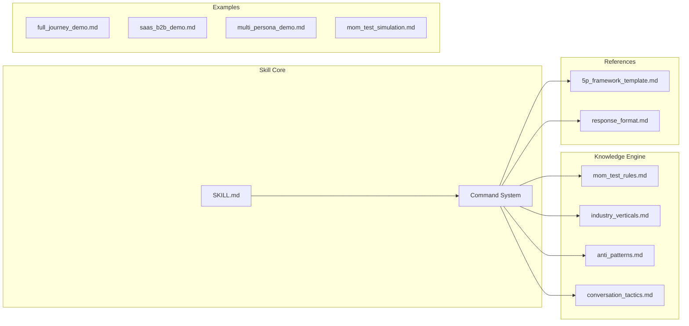

# PersonaTwin: The Mom Test Simulation Skill 🤖

> 🌍 [English](README.md) | 🇻🇳 [Tiếng Việt](README-vi.md)
> 📖 [User Guide](USER_GUIDE.md) | 🇻🇳 [Hướng dẫn Sử dụng](USER_GUIDE-vi.md)

**A specialized AI skill that acts as a synthetic user testing cloud. It applies "The Mom Test" principles to simulate ruthless, real-world user feedback — protecting Product Managers from their own biases.**

[](LICENSE)
[](SKILL.md)
[](tests/promptfooconfig.yaml)
[](SKILL.md)

---

## 🎯 The Value for Product Managers

Building products people want is hard because users often lie to be "polite." **PersonaTwin** protects you from your own biases by acting as a "truth filter."

- **🚫 Kill Compliments**: Automatically filters out "That sounds great!" and extracts only hard evidence of user behavior.
- **⚡ Rapid Prototyping**: Test feature ideas against grounded user personas before writing a single line of code.
- **🧪 The Mom Test in a Box**: Built-in logic that strictly follows Rob Fitzpatrick's principles — focusing on past behavior and current pains.
- **🏗️ Structured Personas**: Uses the **5P Framework** (Profile, Psychology, Pains, Proficiency, Principles) for high-fidelity simulations.
- **🏭 Industry Presets**: Pre-configured persona behaviors for SaaS B2B, F&B/Retail, FinTech, EdTech, Consumer App, and Security/Cybersecurity verticals.
- **🔍 Anti-Pattern Detection**: Automatically detects common PM mistakes like Feature Dumping, Solution First, and Future Tense Traps.

---

## 🏗️ Architecture



### Directory Structure

```
personatwin-skill/
├── SKILL.md                          # Core skill definition (Open Standard)
├── knowledge/                        # Modular Knowledge Engine
│   ├── mom_test_rules.md             # Core Mom Test rules + Truth Filter
│   ├── industry_verticals.md         # SaaS, F&B, FinTech, EdTech, Consumer, Security behaviors
│   ├── anti_patterns.md              # PM anti-pattern detection library
│   └── conversation_tactics.md       # Realistic conversation techniques
├── references/                       # Templates & format specifications
│   ├── 5p_framework_template.md      # 5P Persona building template
│   └── response_format.md            # Output format for each command
├── examples/                         # Gold-standard simulation demos
│   ├── full_journey_demo.md          # End-to-end: Summarize → Build → Test
│   ├── saas_b2b_demo.md              # SaaS B2B CFO persona demo
│   ├── multi_persona_demo.md         # Same pitch, 2 personas comparison
│   └── mom_test_simulation.md        # Quick simulation example
├── tests/                            # Automated QA
│   └── promptfooconfig.yaml          # 8 test cases via promptfoo
├── README.md / README-vi.md          # Documentation (EN/VI)
├── USER_GUIDE.md / USER_GUIDE-vi.md  # User guides (EN/VI)
├── CHANGELOG.md                      # Version history
├── CONTRIBUTING.md                   # Contribution guidelines
├── LICENSE                           # MIT License
└── package.json                      # Project metadata & scripts
```

---

## 🛠️ Key Features

### 1. Modular Knowledge Engine

Structured using XML tags (`<rule>`, `<template>`, `<example>`) across 4 knowledge modules for precise AI retrieval and high-consistency logic.

### 2. Command System

Since PersonaTwin is an AI skill, the way you trigger commands depends on your environment:

- **AI IDEs (Cursor, Windsurf, Copilot)**: `@personatwin @build-persona ...`
- **CLI Agents (Claude Code, Amp, Cline)**: "Use personatwin to `@build-persona`..."
- **ChatGPT / Claude Web**: Paste `SKILL.md` and type `@build-persona ...`

| Command | Action |
| --- | --- |
| `@build-persona [demographics]` | Create high-fidelity 5P personas from demographics |
| `@momtest [feature/idea]` | Pit your feature idea against the ruthless persona |
| `@summarize [transcript]` | Extract the "ugly truth" from raw interview transcripts |
| `@safeai lang [language]` | Switch response language |

### 3. Industry-Aware Personas

Pre-configured behavior rules for 6 industry verticals, ensuring personas react realistically based on their business context.

### 4. Anti-Pattern Detection

Automatically calls out 6 common PM mistakes: Feature Dumping, Solution First, Future Tense Trap, Vanity Metrics, Competitor Comparison, and Premature Scaling.

### 5. Automated QA & Testing

Includes an 8-test `promptfoo` suite covering: No Compliment, Status Quo Anchor, Past Tense Focus, Commitment Test, Brevity, Anti-Feature-Dump, SaaS Consistency, and Language Switch.

---

## 🚀 Quick Start

### Installation (via CLI)

```bash
npx skills add datht-work/personatwin-skill
```

### Manual Setup

1. Copy **[SKILL.md](SKILL.md)** content into your AI assistant's instructions.
2. Provide the **`knowledge/`**, **`references/`**, and **`examples/`** folders as context/knowledge files.

---

## 🌐 Compatibility

PersonaTwin follows the **SKILL.md Open Standard** and is compatible with:

- **Claude Code** (Anthropic)
- **Cursor** (AI Code Editor)
- **Codex** (OpenAI)
- **Any agent** that supports the SKILL.md specification

---

## 📋 Version History

| Version | Date | Highlights |
| --- | --- | --- |
| **v2.0.0** | 2026-03-29 | **Major Upgrade**. SKILL.md Open Standard compliance. Knowledge Engine x4. Test suite x8. Industry verticals. Anti-pattern detection. |
| **v1.3.0** | 2026-03-27 | **Housekeeping & Consistency**. Added LICENSE, CHANGELOG, CONTRIBUTING. Fixed version drift. |
| **v1.2.0** | 2026-03-27 | **Quality & Integration**. Full journey demo, Good vs Bad table, lint fixes. |
| **v1.1.0** | 2026-03-27 | **Skill AI Safe Standard Upgrade**. Modular Knowledge Engine, Command System, XML-tag support. |
| **v1.0.0** | 2026-03-26 | Initial Release — Basic Mom Test simulation. |

---

## 🤝 Contributing

We welcome contributions to the `knowledge/` base, especially:

- New industry-specific persona verticals
- Additional anti-patterns and conversation tactics
- Localized persona behaviors for different markets
- New test cases for the `promptfoo` suite

See [CONTRIBUTING.md](CONTRIBUTING.md) for guidelines.

---

## 📄 License

MIT License — see [LICENSE](LICENSE) for details.

> ⚠️ **Disclaimer:** This skill provides training and simulation guidance. It is not a substitute for talking to real human users.

*Built with ❤️ by PersonaTwin Team · v2.0.0 · March 2026*
