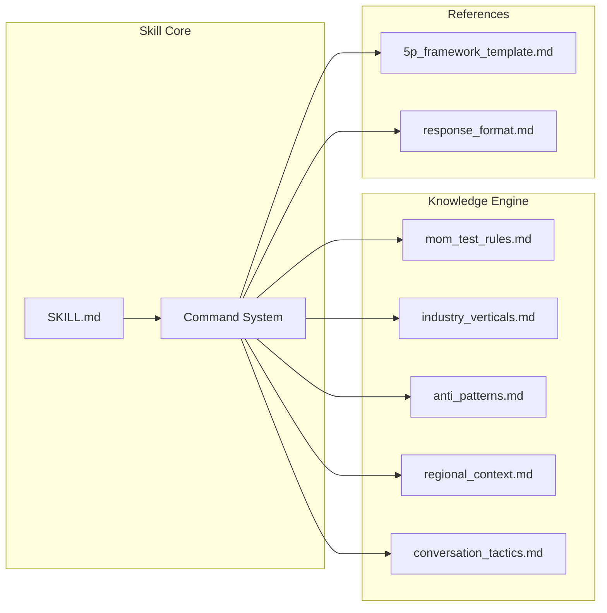

# PersonaTwin: Kỹ năng Giả lập "The Mom Test" 🤖 (Tiếng Việt)

> 🌍 [English](README.md) | 🇻🇳 [Tiếng Việt](README-vi.md)
> 📖 [User Guide](USER_GUIDE.md) | 🇻🇳 [Hướng dẫn Sử dụng](USER_GUIDE-vi.md)

**Kỹ năng AI cung cấp môi trường "giả lập người dùng" (synthetic user testing). PersonaTwin áp dụng nghiêm ngặt nguyên lý "The Mom Test" để tạo ra các phản hồi thực tế và "phũ phàng" nhất — giúp bảo vệ toàn bộ Đội ngũ Phát triển Sản phẩm (Biz, PM, PO, và UI/UX) khỏi thiên kiến cá nhân và ngăn lãng phí nguồn lực lập trình.**

[](LICENSE)
[](SKILL.md)
[](tests/promptfooconfig.yaml)
[](SKILL.md)

---

## 🎯 Giá trị cho Toàn bộ Đội ngũ Sản phẩm (Product Squad)

Xây dựng một sản phẩm mà khách hàng thực sự chi tiền là việc rất khó vì người dùng hay "nói dối" do cả nể. Chi phí của việc code sai tính năng là vô cùng đắt đỏ. **PersonaTwin** đóng vai trò là "bộ lọc sự thật" để giảm thiểu rủi ro cho từng vị trí dự án:

- **📈 Khối Kinh doanh & Chiến lược (Biz)**: Kiểm chứng nhu cầu thị trường và mức độ sẵn sàng trả tiền (WTP) *trước khi* cấp ngân sách. Ngăn công ty đốt tiền vào các tính năng "có thì vui" nhưng không đem lại doanh thu.
- **🧠 Product Managers (PM) & Owners (PO)**: Ưu tiên Backlog dựa trên bằng chứng về nỗi đau thực tế thay vì những câu "có lẽ tôi sẽ dùng" đầy rủi ro. Xuất ngay Bảng Điểm Chiến lược bằng lệnh `@final-summary`.
- **🎨 Đội ngũ UI/UX Design**: Phát hiện sớm các điểm nghẽn (friction) trong luồng thao tác. Kiểm thử tính năng với persona có "trình độ công nghệ kém" (ví dụ: Chủ tiệm thuốc truyền thống) để xem chi phí học hỏi giao diện mới (learning curve) có quá cao hay không.
- **🌍 Mở Rộng Thị Trường**: Giả lập bối cảnh văn hóa địa phương (VD: Thói quen xài Zalo ở Việt Nam vs. Luật GDPR ở Châu Âu) để đánh giá mức độ phù hợp thị trường (Product-Market Fit) của tính năng.
- **🚫 Triệt tiêu Sự Khách sáo**: Tự động chặn màng lọc các lời khen vô bổ như "Ý tưởng hay đấy!" để nhìn thấu hành vi thật.

---

## 🏗️ Kiến trúc Hệ thống



### Cấu trúc thư mục

```
personatwin-skill/
├── SKILL.md                          # Tệp lõi định nghĩa thiết lập Skill
├── knowledge/                        # Hệ thống Tri thức Mô-đun (Knowledge Base)
│   ├── mom_test_rules.md             # Core Rule Momtest & Truth Filter
│   ├── industry_verticals.md         # Hành vi theo ngành: SaaS, F&B, FinTech, v.v.
│   ├── regional_context.md           # Hành vi theo khu vực: Vietnam, SEA, USA, EU
│   ├── anti_patterns.md              # Thư viện Bắt lỗi thiên kiến của PM/Biz
│   └── conversation_tactics.md       # Hành vi mâu thuẫn/cảm xúc người dùng
├── references/                       # Khuôn mẫu format đầu ra (Dashboard, Persona Card)
├── examples/                         # Ví dụ giả lập chạy thử
├── tests/                            # Kiểm thử tự động (promptfoo)
├── README.md / README-vi.md          # Tài liệu tổng quan (EN/VI)
├── USER_GUIDE.md / USER_GUIDE-vi.md  # Hướng dẫn sử dụng từng bước (EN/VI)
├── CHANGELOG.md                      # Lịch sử các phiên bản
└── package.json                      # Cấu hình dự án
```

---

## 🛠️ Các Tính năng Chính

### 1. Hệ thống Lệnh Thao tác

Tương tác trực tiếp với PersonaTwin bên trong không gian làm việc AI của bạn:

| Lệnh tác vụ | Lợi ích cho Team Sản phẩm |
| --- | --- |
| `@build-persona [thông tin]` | Tạo tệp Persona nội hàm sâu (khung 5P) dùng cho UX targeting. |
| `@momtest [ý tưởng]` | Đưa giả thuyết/tính năng cho khách hàng ảo "đập tơi bời" để tìm Nỗi Đau thực. |
| `@summarize [transcript]` | Trích xuất các sự thật "trần trụi" từ tệp ghi âm/ghi chú phỏng vấn thật. |
| `@final-summary` | Xuất **Bảng Phân tích Cấp Chiến lược** để báo cáo lên C-Level hoặc chuẩn bị Sprint. |

### 2. Mô phỏng Đa Ngành & Phân Vùng Chuyên Sâu

Test ngay sản phẩm trên 6 khối ngành (SaaS B2B, F&B, FinTech, v.v.) và được lót lớp bối cảnh địa phương (Ví dụ: SME Việt Nam chuộng Zalo, CISO của Mỹ đòi hỏi SOC2).

### 3. Công Cụ Bắt Mạch "Cạm bẫy Product" (Anti-Pattern)

Mỗi lần Biz hoặc PM trình bày ý tưởng theo cách sai lầm (như Feature Dumping, Solution First, Future Tense Trap), PersonaTwin sẽ cảnh báo và bắt quay góc độ giải quyết vấn đề.

---

## 🚀 Hướng Rút Ngắn Triển Khai

### Cài đặt (via CLI)

```bash
npx skills add datht-work/personatwin-skill
```

### Cài đặt Trực tiếp (IDE / Assistant)

1. Sao chép thẳng nội dung **[SKILL.md](SKILL.md)** gắn vào prompt hệ thống của công cụ AI bạn đang dùng. (*Mẹo: Phiên bản trong `.agents/skills/personatwin/SKILL.md` đã nhúng sẵn toàn bộ luật rất dễ xài cho Agent cục bộ*).
2. Gọi các lệnh được mô tả trong [Tài liệu Hướng dẫn (User Guide)](USER_GUIDE-vi.md).

---

## 🌐 Tương thích

PersonaTwin hoàn toàn tuân thủ **SKILL.md Open Standard**, sử dụng trên:

- **Claude Code** (Anthropic)
- **Cursor** / **Windsurf** / **Copilot** (AI Code Editors)
- Các cấu hình trình giả lập **Web** (ChatGPT / Claude Web UIs)

---

## 📋 Lịch sử Nâng Cấp Sản Phẩm

| Phiên bản | Ngày | Điểm nổi bật |
| --- | --- | --- |
| **v3.0.0** | 01/04/2026 | **Mở Rộng Chiến Lược**. 4 ngành mới (Y tế, Bất động sản, Logistics, Nông nghiệp). 3 region mới (NHẬT\/HÀN, LATAM, CHÂU PHI\/TRUNG ĐÔNG). Lệnh `@interview-plan`, `@learning-log`. GitHub CI. 20 test cases. |
| **v2.3.0** | 01/04/2026 | **Coaching & Intelligence**. Lệnh `@coach`, `@dig-deeper`, phân loại Early Adopter, Customer Slicing. Attribution Rob Fitzpatrick. |
| **v2.2.0** | 01/04/2026 | **Tuân thủ Mom Test++**. Bộ phân loại Bad Data. Khung Commitment & Advancement. Chiến thuật Đào sâu. 12 test cases. |
| **v2.1.0** | 30/03/2026 | **Phiên bản Prod**. Thêm Regional Context Rules, lệnh `@final-summary` báo cáo chiến lược, module Agent nhúng độc lập. |
| **v2.0.0** | 29/03/2026 | **Bản Upgrade Chính**. Tuân chuẩn SKILL.md. Expand gấp x4 lần lõi Knowledge phân tách. Thêm quy trình test x8 promptfoo. |
| **v1.3.0** | 27/03/2026 | **Quy chuẩn hóa Open-Source**. Thêm License, Changelog, file rule Contributor. |
| **v1.2.0** | 27/03/2026 | **Hoàn thiện CaseStudy**. Bản Demo hành trình từ thu thập đến báo cáo. Khắc phục lỗi chuẩn markdown linter. |

---

## 📚 Nền Tảng Tri Thức

PersonaTwin được xây dựng dựa trên phương pháp luận trong cuốn sách **"The Mom Test"** của tác giả **Rob Fitzpatrick**.

> *"The Mom Test là bộ quy tắc đơn giản giúp tạo ra những câu hỏi tốt — tốt đến mức người thân của bạn cũng không thể nói dối bạn được."*
> — Rob Fitzpatrick

The Mom Test dạy các startup và đội nhóm sản phẩm cách nói chuyện với khách hàng và khám phá xem liệu ý tưởng sản phẩm có tốt hay không — ngay cả khi mọi người đang nói dối để giữ lịch sự. Đây là cuốn sảch nền tảng bắt buộc cho bất kỳ ai làm product.

| | |
|:---|:---|
| **Sách** | [The Mom Test](https://www.momtestbook.com/) — Rob Fitzpatrick |
| **Mua bản In** | [Amazon (geni.us/momtest)](https://geni.us/momtest) |
| **Mua bản PDF** | [Gumroad](https://gumroad.com/l/momtest) |
| **Khóa học Online** | [Practical Customer Development trên Udemy](https://www.udemy.com/practical-customer-development/) |
| **Tác giả** | [robfitz.com](http://robfitz.com/) |

> **Tuyên bố minh bạch:** PersonaTwin là một AI skill độc lập được **truyền cảm hứng từ** phương pháp luận của The Mom Test. Không có bất kỳ liên kết chính thức nào với Rob Fitzpatrick hoặc các ấn phẩm của ông. Chúng tôi trân trọng mạnh mẽ việc bạn đọc nguyên tác — cuốn sách gốc sâu sắc hơn bất kỳ mô phỏng nào rất nhiều.

---

## 📄 Bản Quyền & Trách Nhiệm

Cấp phép mã nguồn mở MIT License — xem [LICENSE](LICENSE) để biết chi tiết.

> ⚠️ **Lưu ý Giới hạn:** Kỹ năng này cung cấp các phân tích mô phỏng đẳng cấp để tiết kiệm chi phí làm sản phẩm và tinh chỉnh hướng đi kinh doanh. Đây *KHÔNG* phải là phương án thay thế việc phỏng vấn con người và người dùng mua hàng thực tế ngoài đời.

*Được xây dựng với ❤️ bởi PersonaTwin Team · Phiên bản 3.0.0 · Tháng 04/2026*
