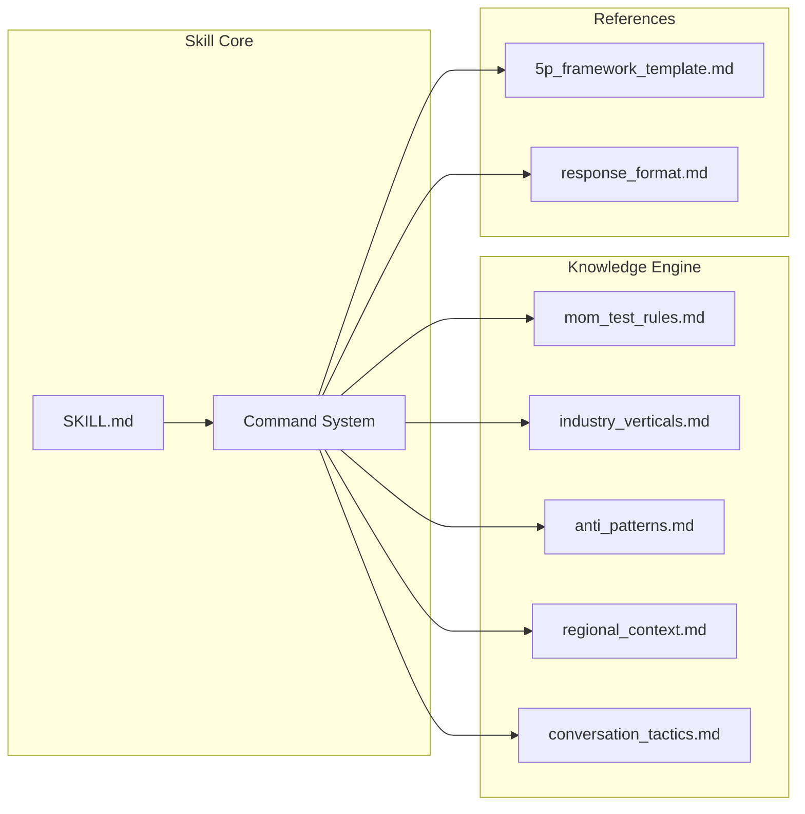

# PersonaTwin: The Mom Test Simulation Skill 🤖

> 🌍 [English](README.md) | 🇻🇳 [Tiếng Việt](README-vi.md)
> 📖 [User Guide](USER_GUIDE.md) | 🇻🇳 [Hướng dẫn Sử dụng](USER_GUIDE-vi.md)

**A specialized AI skill that acts as a synthetic user testing cloud. It applies "The Mom Test" principles to simulate ruthless, real-world user feedback — protecting Product Teams (Business, PMs, POs, and UI/UX) from their own biases to prevent wasted development cycles.**

[](LICENSE)
[](SKILL.md)
[](tests/promptfooconfig.yaml)
[](SKILL.md)

---

## 🎯 The Value for the Entire Product Squad

Building products people want is hard because users often lie to be "polite." The cost of building the wrong feature is massive. **PersonaTwin** acts as a "truth filter" to de-risk development for every stakeholder:

- **📈 For Business & Strategy Leaders**: Validate market demand and willingness-to-pay *before* allocating budget. Prevent the company from building "nice-to-have" features that don't drive revenue.
- **🧠 For Product Managers (PM) & Owners (PO)**: Prioritize the backlog using hard evidence of past user behavior instead of hypothetical "I would use this" statements. Generate actionable feature strategies using the built-in `@final-summary` engine.
- **🎨 For UI/UX Designers**: Discover usability friction early. Test your proposed workflows against specific technical proficiency levels (e.g., a "non-tech-savvy pharmacy owner") to see if the switching cost is too high.
- **🌍 Regional Market Validation**: Dynamically inject local market contexts (e.g., Vietnam vs. USA) to test cross-border product-market fit before launching physical or marketing campaigns.
- **🚫 Kill Compliments**: Automatically filters out polite noise like "That sounds great!" and extracts only what users are *actually doing*.

---

## 🏗️ Architecture



### Directory Structure

```
personatwin-skill/
├── SKILL.md                          # Core skill definition (Open Standard)
├── knowledge/                        # Modular Knowledge Engine
│   ├── mom_test_rules.md             # Core Mom Test rules + Truth Filter
│   ├── industry_verticals.md         # SaaS, F&B, FinTech, EdTech, Consumer, Security
│   ├── regional_context.md           # Localized behaviors (Vietnam, SEA, USA, EU)
│   ├── anti_patterns.md              # PM anti-pattern detection library
│   └── conversation_tactics.md       # Realistic conversation techniques
├── references/                       # Templates & format specifications
│   ├── 5p_framework_template.md      # 5P Persona building template
│   └── response_format.md            # Output format: Summaries, Dashboards, Cards
├── examples/                         # Gold-standard simulation demos
├── tests/                            # Automated QA (promptfoo suite)
├── README.md / README-vi.md          # Documentation (EN/VI)
├── USER_GUIDE.md / USER_GUIDE-vi.md  # Step-by-step User guides (EN/VI)
├── CHANGELOG.md                      # Version history
└── package.json                      # Project metadata
```

---

## 🛠️ Key Features

### 1. The Command System

Since PersonaTwin is an AI skill, you trigger commands right inside your AI environment:

| Command | Action for the Squad |
| --- | --- |
| `@build-persona [demographics]` | Generate high-fidelity 5P personas for your UX targeting |
| `@momtest [idea]` | Pit a feature idea against the ruthless persona to find the "No" |
| `@summarize [transcript]` | Extract the "ugly truth" from user interview recordings |
| `@final-summary` | Export a **Validation Dashboard** detailing strategic recommendations |

### 2. Multi-Market / Industry Personas

Test your designs against 6 industry verticals (SaaS B2B, F&B, FinTech, etc.) layered over deep regional contexts (Vietnam's Zalo-first SMEs vs. USA's compliance-heavy enterprises).

### 3. Anti-Pattern Detection for Teams

Protects the team by automatically flagging PM/Biz mistakes during pitches: Feature Dumping, Solution First, Future Tense Trap, Vanity Metrics, Competitor Comparison, and Premature Scaling.

---

## 🚀 Quick Start

### Installation (via CLI)

```bash
npx skills add datht-work/personatwin-skill
```

### Manual Setup for your IDE / Agent

1. Copy **[SKILL.md](SKILL.md)** content into your AI assistant. (*Note: The `.agents/skills/personatwin/SKILL.md` version is fully self-contained with all embedded rules for local agents.*)
2. Follow the commands in the [User Guide](USER_GUIDE.md).

---

## 🌐 Compatibility

PersonaTwin follows the **SKILL.md Open Standard** and is compatible with:

- **Claude Code** (Anthropic)
- **Cursor** (AI Code Editor)
- **Windsurf** / **Copilot**
- **ChatGPT / Claude Web UIs**

---

## 📋 Version History

| Version | Date | Highlights |
| --- | --- | --- |
| **v3.0.0** | 2026-04-01 | **Strategic Expansion**. 4 new industry verticals (Healthcare/Real Estate/Logistics/AgTech). 3 new regions (JP\/KR, LATAM, Africa\/ME). `@interview-plan`, `@learning-log`. GitHub Actions CI. 20 test cases. |
| **v2.3.0** | 2026-04-01 | **Coaching & Intelligence**. `@coach`, `@dig-deeper`, Early Adopter classification, Customer Slicing, Rob Fitzpatrick attribution. |
| **v2.2.0** | 2026-04-01 | **Mom Test Compliance++**. Bad Data Taxonomy. Commitment & Advancement. Digging tactics. 12 test cases. |
| **v2.1.0** | 2026-03-30 | **Prod Ready**. Added Regional Context Rules. Added Validation Summary Table (`@final-summary`). Self-contained embedded agents. |
| **v2.0.0** | 2026-03-29 | **Major Upgrade**. SKILL.md compliance. Knowledge Engine x4. Test suite x8. Industry verticals. |
| **v1.3.0** | 2026-03-27 | **Housekeeping & Consistency**. Added LICENSE, CHANGELOG, CONTRIBUTING. |
| **v1.2.0** | 2026-03-27 | **Quality & Integration**. Full journey demo, Good vs Bad table. |
| **v1.1.0** | 2026-03-27 | **Skill AI Safe Standard Upgrade**. Modular Knowledge Engine. |

---

## 📚 Intellectual Foundation

PersonaTwin is built on the ideas and methodology of **"The Mom Test"** by **Rob Fitzpatrick**.

> *"The Mom Test is a set of simple rules for crafting good questions that even your mother couldn't lie to you about."*
> — Rob Fitzpatrick

The Mom Test teaches entrepreneurs and product teams how to talk to customers and learn if a business idea is good — even when everyone is lying to be polite. It is the definitive guide for bias-free customer discovery.

| | |
|:---|:---|
| **Book** | [The Mom Test](https://www.momtestbook.com/) — Rob Fitzpatrick |
| **Buy Paperback** | [Amazon (geni.us/momtest)](https://geni.us/momtest) |
| **Buy PDF** | [Gumroad](https://gumroad.com/l/momtest) |
| **Online Course** | [Practical Customer Development on Udemy](https://www.udemy.com/practical-customer-development/) |
| **Author** | [robfitz.com](http://robfitz.com/) |

> **Disclaimer:** PersonaTwin is an independent AI skill **inspired by** The Mom Test methodology. It is not affiliated with, endorsed by, or officially connected to Rob Fitzpatrick or his work. We strongly encourage you to read the original book — the real thing is far richer than any simulation.

---

## 📄 License & Disclaimer

MIT License — see [LICENSE](LICENSE) for details.

> ⚠️ **Disclaimer:** This skill provides world-class simulation to protect development budgets and refine hypotheses. It is *not* a total substitute for talking to real, paying human users.

*Built with ❤️ by PersonaTwin Team · Version 3.0.0 · April 2026*
